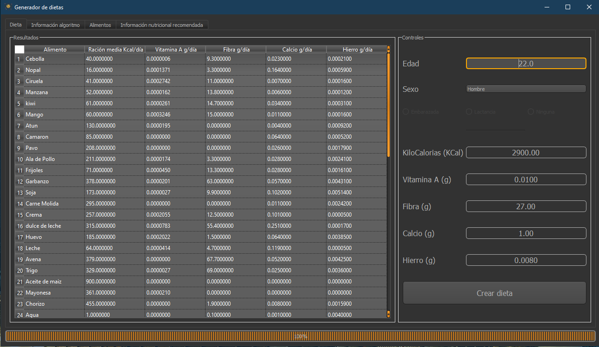
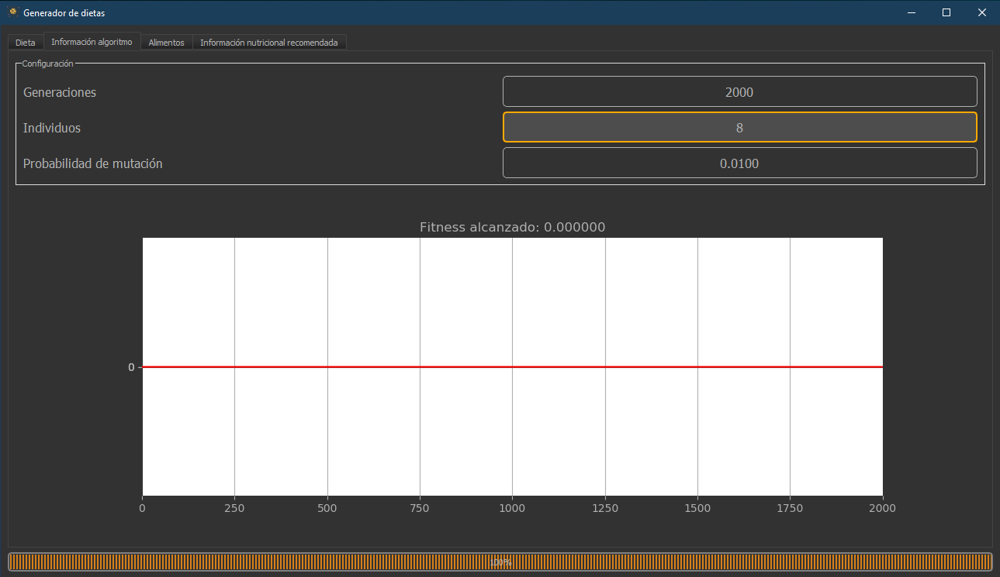
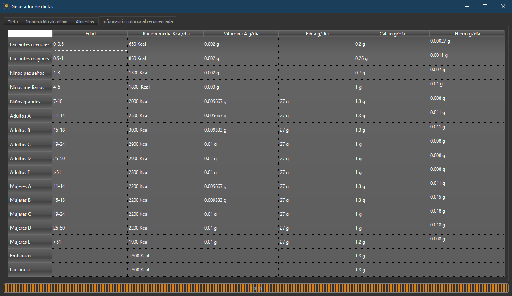

# <center>Proyecto Final - Seminario de Solución de Problemas de Inteligencia Artificial I</center>


## Uso
<p>Los siquientes elementos son necesarios para la ejecución del código</p>

+ Python 3.7.x
+ [Miniconda](https://docs.conda.io/en/latest/miniconda.html)
+ PyQt 5
+ Qt Designer

### Instalar PyQt 5 y Qt Designer

```
conda update --all
conda install qt
conda install pyqt
```

### Iniciar el editor Qt

En el terminal ejecutar `designer` y abrir el archivo Interface_MLP.ui

### Convertir cambios a Python

Para que los cambios en el editor de interfaces surta efecto, es necesario ejecutar el siguiente comando que transformara el archivo `Interface_AGB.ui` en un archivo `Interface_AGB.py`

```
pyuic5 -x UI\Interface_AGB.ui -o UI\Interface_AGB.py --import-from UI.resources
```

#### Convertir cambios en los recursos

En dado caso de haber hecho modifiaciones en los recursos de la interfaz, es necesario ejecutar el siguiente comando:

```
pyrcc5 UI\resources\resources.qrc -o UI\resources\resources_rc.py
```

### Cambios de funcionalidades

Para agregar funcionalidades en el programa es necesario trabajar sobre el archivo `ui_backend.py` en la clase `MainWindow`

### Ejecutar programa

Para la ejecución del programa se debe hacer en la shell el siguiente comando

```
python "__main__.py"
```

## Screenshoots

+ Ventana de la dieta


+ Ventana de la información del algoritmo


+ Ventana de información nutricional recomendada



## Dependecias
+ [PyQt5](https://www.riverbankcomputing.com/static/Docs/PyQt5/)
+ [Matplotlib](https://matplotlib.org/)
+ [Numpy](https://numpy.org/)

## Licencia
[MIT](https://choosealicense.com/licenses/mit/)